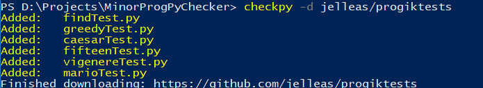

# Python Installeren

Vanaf nu gaan we niet meer werken in de CS50 IDE. Aangezien je Python nodig gaat hebben tijdens de rest van jouw studie is het handig dit te installeren op jouw eigen computer. Hieronder vind je de instructies.

## Om te beginnen

Om straks de Python problem sets te maken op jouw eigen computer heb je een aantal verschillende programma's nodig: de taal zelf, een goede editor, en CheckPy!

1. **Python3**, de nieuwste versie van Python. We gaan deze kaal installeren en je vervolgens leren hoe je packages kan downloaden en installeren. Zo ben je meteen een stuk flexibeler! :)

2. **Visual Studio Code**, een *editor* om code in te schrijven. Dit is in feite een soort tekstverwerker, maar dan speciaal bedoeld voor programmacode. Zo is er onder andere syntax highlighting en als bijkomend voordeel lijkt deze editor heel erg op de CS50 IDE! Wanneer je straks klaar bent met dit vak, ben je vrij jouw eigen editor te kiezen.

3. **CheckPy**, een programma om jouw Python code te testen. Denk check50, maar nu voor Python! :)

## Stap 1: Python 3

Ben je een eerstejaars KI-er en heb je Ubuntu geinstalleerd staan. Voer dan in Ubuntu de volgende commando's in de terminal in:

	sudo apt install python3 python3-pip

Ben je geen eerstejaars KI-er en heb je geen Ubuntu tot je beschikking, doe dan het volgende: Download [Python](https://www.python.org/downloads/). Kies daar voor Python versie 3.6.x (op het moment van schrijven is dat versie 3.6.2)!

Zodra de download klaar is, moet je het gedownloade bestand uitvoeren. Volg dan de installatieinstructies, als het goed is hoef je verder niks te veranderen.

## Stap 2: Visual Studio Code

Dit pakket kun je downloaden op de website van [Microsoft](https://code.visualstudio.com/). Ook hier geldt dat je het bestand nog moet uitvoeren en installeren. Je hoeft niks aan te passen aan de installatie-opties. Heb je een Mac? Dan wordt het programma in jouw Downloads-map gezet. Je kunt het vanuit daar gewoon slepen naar de applications folder.

**Tip:** In het dropdown menu *view* kan je de integrated terminal aanklikken!

## Stap 3: Checkpy

Net zoals bij CS50 hebben wij een test programma om jouw code te testen. Wel zo fijn voor jou en voor de nakijkers :)
Om zelf de tests te kunnen draaien moet je checkpy installeren. Laat het nou net een Python programma zijn! Installeren is super eenvoudig. Voer simpelweg het volgende commando uit in de terminal (of command prompt/powershell onder windows):

Ubuntu:

	python3 -m pip install checkpy --user

Mac:

	python3 -m pip install checkpy

Windows (in het vervolg overal waar je python3 ziet staan, type py -3):

	py -3 -m pip install checkpy

Als je stap 2 hebt uitgevoerd, en de integrated terminal optie hebt aangevinkt in Visual Studio Code, dan heb je daar een terminal tot je beschikking. Anders kan je altijd een terminal openen door te zoeken naar terminal op jouw Mac. Onder windows is er geen terminal, maar wel een powershell. Deze heeft net even andere commando's maar dat went vanzelf. Deze kun je openen door op de windows toets te drukken en te zoeken naar powershell.

## Stap 4: Tests downloaden

Checkpy is enkel het test programma, nu heb je nog tests nodig. Deze kun je downloaden door het volgende commando uit te voeren:

	checkpy -d jelleas/progiktests

Als het goed is zie je ongeveer de volgende tekst op jouw scherm (evt. zie je wat andere tests):

Gaat het niet goed, tik even de assistent aan in het laptopcollege!
