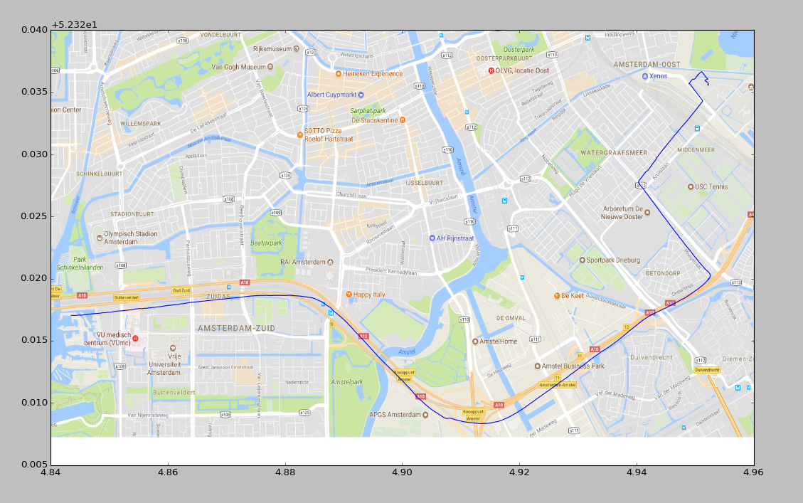

# Auto

Een mobiele telefoon bevat veel delicate sensoren die informatie verzamelen over de positie, snelheid, versnelling. Een stel natuurkundigen hebben gedurende een korte auto-rit de data opgeslagen en in een bestand weggeschreven met een frequentie van 1[Hz]. Het verzamelen van de data begon toen de auto zich bevond op de plek waar de snelweg A4 op de ringweg A10 aansluit. Het verzamelen van de data stopte toen de auto op het Nikhef was aangekomen.

We gaan de data van de rit analyseren en visueel maken door deze over een map van amsterdam te leggen. Zo kan je precies zien waar de auto heeft gereden. Ook gaan we onderzoeken waar de auto meer dan 50 km/uur heeft gereden.

De sensordata is beschikbaar in het bestand `autorit.data`, deze kan je [hier](autorit.data) downloaden.

### Tussenstap 1: Preprocessing
Maak een nieuw notebook aan genaamd `auto`. Zorg dat het databestand in dezelfde map staat als het net aangemaakt notebook. Dubbel check het even! Zodra je dat hebt gedaan, ga je de data preprocessen in het notebook. Maak een cell aan in het notebook dat het databestand opent, inleest, en wegschrijft als `auto.csv`. Zorg dat de eerste rij bestaat uit de kolomnamen, en de rijen daarop volgend uit alle waardes. Waardes scheid je door een komma, want anders zijn het ook geen Comma Seperated Values.

Het data bestand begint met de namen van de 36 kolommen, elk op één regel. Dan zijn er 761 datapunten met elke 36 waardes. Deze datapunten staan elk op twee regels, gevolgd door een witregel. De waardes zijn gescheiden door een `;`. Open het bestand maar eens met een tekst editor om een beeld te krijgen van het formaat. De eerste regel van het nieuwe `.csv` bestand, genaamd `auto.csv`, moet bestaan uit alle kolomnamen, gescheiden door een komma. De volgende 761 regels moeten alle datapunten zijn, elk op één regel, waar alle waardes gescheiden zijn door een komma.

Zet boven de cell met code een markdown cell met daarin tenminste een kopje en kort toegelicht wat de code eronder doet.

### Tussenstap 2: De autorit visualiseren

Om je een beetje op weg te helpen geven we je hier een stukje code om de autorit te visualiseren d.m.v. matplotlib:

Ubuntu:

    import matplotlib
    matplotlib.use("Agg")
    import matplotlib.pyplot as plt
    %matplotlib inline
    import pandas as pd

    # read data
    data = pd.read_csv("autorit.csv")

    # create figure
    fig = plt.figure()

    # create subplot
    ax = fig.add_subplot(111)

    # plot long and lat data
    ax.plot(data["long"], data["lat"], zorder = 1)

    # set background img
    x0, x1 = ax.get_xlim()
    y0, y1 = ax.get_ylim()
    img = plt.imread("kaart.png")
    ax.imshow(img, extent = [x0, x1, y0, y1], aspect = "auto", zorder = 0)

    # save plot
    plt.savefig("ride.png")

Mac / Windows:

    import pandas as pd
    import matplotlib.pyplot as plt

    # read data
    data = pd.read_csv("autorit.csv")

    # create figure
    fig = plt.figure()

    # create subplot
    ax = fig.add_subplot(111)

    # plot long and lat data
    ax.plot(data["long"], data["lat"], zorder = 1)

    # set background img
    x0, x1 = ax.get_xlim()
    y0, y1 = ax.get_ylim()
    img = plt.imread("kaart.png")
    ax.imshow(img, extent = [x0, x1, y0, y1], aspect = "auto", zorder = 0)

    # save plot
    plt.savefig("ride.png")

> Download [hier](kaart.png) het achtergrond plaatje.

De code ziet er misschien wat ingewikkeld uit, maar het is niks meer dan een plaatje toevoegen op de achtergrond. Enkel gebruiken we nu een subplot van matplotlib, en de grootte van deze subplot om het plaatje te schalen. Zet deze code in een cell, en run het eens. Je ziet dan als het goed is het volgende plaatje:

### Tussenstap 3: Afgelegde afstand

Maak een nieuwe cell dat uitprint wat de geschatte afgelegde afstand in kilometers (op 2 decimalen nauwkeurig) van de auto is. Gebruik hiervoor de snelheid op elke tijdstap, en neem aan dat er één meetpunt per seconde is gedaan (we negeren de kleine schommelingen even).

Zet boven de cell met code een markdown cell met daarin tenminste een kopje en kort toegelicht wat de code eronder doet.

### Tussenstap 4: Sneller dan 50 km/u

Maak een nieuwe cell dat de afgelegde route van de auto laat zien. Kleur de stukken waar de auto 50 km/u of sneller rijdt rood, en de stukken waar de auto langzamer dan 50km/u rijdt blauw. Print op de eerste regel uit hoeveel seconden de auto sneller heeft gereden dan 50 km/u. Let op, de snelheid in `autorit.csv` is in m/s.

Zet boven de cell met code een markdown cell met daarin tenminste een kopje en kort toegelicht wat de code eronder doet.

Om de lijnen te kleuren is het het makkelijkst om meerdere kleine lijn segmenten te plotten. Ga door de data heen, en verzamel telkens de longitude en latitude data in bijvoorbeeld een lijst. Doe dit totdat de snelheid ineens onder of boven de 50 km/u komt. Plot vervolgens de verzamelde longitudes en latitudes d.m.v. `ax.plot(longitudes, latitudes, zorder=1, color="red")`, of `color="blue"` voor een blauwe lijn.

## Testen

    checkpy auto
