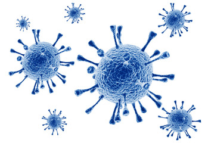

# Virus: Infection

{:.inline}{: style="width:100%"}

Voor o.a. de farmaceutische industrie is het belangrijk om de succeskans van een geneesmiddel te bepalen.
Dit is lastig analytisch te doen, maar we kunnen het wel modelleren.
In deze opdracht ga je virusdeeltjes simuleren, welke kunnen reproduceren en sterven.
We bouwen deze opdracht stap voor stap op, tot een gehele simulatie.

## Tussenstap 1: Virusgenoom

Als model voor een virusgenoom gaan we gebruik maken van een DNA string welke bestaat uit de vier nucleotiden ATGC.
A (Adenine) is altijd verbonden met T (Thymine), G (Guanine) is altijd verbonden met C (Cytosine).
Voor de representatie doen we het volgende, een serie van nucleotides in een string.
Aangezien er maar 4 mogelijkheden zijn voor baseparen (AT, GC, TA, CG), kunnen we dit encoderen met de 4 letters.
Zie bijvoorbeeld de volgende string:

	AGTC

Dit is een DNA string met alle vier base paren, eerst het paar AT, dan GC, dan TA, en als laatste CG.
Effectief laten we telkens het aanhangende nucleotide weg, dat maakt de representatie wat simpeler!

* Maak een nieuw bestand aan genaamd `infection.py` (hopelijk vind jouw virusscanner dit okee ;).
* Schrijf een functie `generateVirus(length)`.
	* Deze functie accepteert één argument, `length`, dat is een integer die de lengte van het virusgenoom representeerd.
	* De functie moet een string returnen bestaande uit een willekeurige sequentie van nucleotides.
* Oh, one more thing: Je mag maar **twee regels code** gebruiken voor deze functie (dat is inclusief de regel `def generateVirus(length):`).

### Tips

* Kijk eens naar de `random.choice()` functie.
* Gebruik een [list comprehension](/theory/comprehensions) en de `"".join()` methode van een string.

## Tussenstap 2: Muteren

Zodra een virus wordt geboren heeft deze een kans te muteren.
Muteren is het veranderen van één willekeurig nucleotide voor een willekeurige ander.
Bijvoorbeeld van AGTC naar ATTC.

* Schrijf een functie `mutate(virus)`.
	* Deze functie accepteert één argument, `virus`, dat is een string van nucleotides.
	* De functie moet een string returnen bestaande uit dezelfde nucleotides, waarvan er één is gemuteerd.
* Geen regellimiet dit keer, maar als je jezelf wilt uitdagen: 3 (of minder) regels is mogelijk.

### Tips

* Kijk eens naar de `random.randrange()` functie!
* Gebruik list slicing.

## Tussenstap 3: Afsterven

Virussen sterven uiteindelijk ook, dit gebeurt met een bepaalde kans per tijdstap in de simulatie.

* Schrijf een functie `kill(viruses, mortalityProb)`.
	* Deze functie accepteert twee argumenten:
		* `viruses` is een lijst van virusgenomen.
		* `mortalityProb` is een float tussen 0 en 1 (inclusief) die de kans op het afsterven per virusdeeltje representeert.
	* De functie moet een **nieuwe** lijst returnen met daarin de virusgenomen die het hebben overleefd.
* Let op, elk virusgenoom heeft een individuele kans om af te sterven. Dus bij een `mortalityProb` van 0.2 overleeft gemiddeld 80% van de viruspopulatie het, maar dit kan fluctueren!
* Je mag hier **twee regels code** gebruiken (dat is inclusief de regel `def kill(viruses, mortalityProb):`).

### Tip

* Gebruik een list comprehension!

## Tussenstap 4: Reproductie

Een virus heeft een kans zich voort te planten op elke tijdstap in de simulatie.
Als een virus zich voortplant dan heeft het kind exact dezelfde DNA string als de ouder.
Behalve als het kind muteert, dan is er één basepaar anders.

* Schrijf voor reproductie een functie `reproduce(viruses, mutationProb, reproductionProb)`.
	* Deze functie accepteert drie argumenten:
		* `viruses` is een lijst van virusgenomen.
		* `mutationProb` is een float tussen 0 en 1 (inclusief) die de kans op mutatie bij reproductie representeert.
		* `reproductionProb` is een float tussen 0 en 1 (inclusief) die de kans op reproductie per virusdeeltje representeert.
* De functìe moet de lijst van de totale populatie van virusgenomen returnen. Dat is dus inclusief de ouders!
* Let op, elk virusgenoom heeft een individuele kans om te reproduceren. Dus bij een `reproductionProb` van 0.2 reproduceert gemiddeld 20% van de populatie, maar dit kan fluctueren!
* Geen regellimiet dit keer, maar als je jezelf wilt uitdagen: 2 regels is mogelijk.

## Tussenstap 5: Populatie grootte

Naarmate er meer virusdeeltjes aanwezig zijn, wordt de kans op reproductie kleiner.
Er is simpelweg niet genoeg ruimte voor alle virusdeeltjes.
Er is een negatief linear verband tussen het aantal virussen en de reproductie kans.
De kans op reproductie is gelijk aan `(1 - (grootte_van_virus_populatie / maximaal_aantal_virussen)) * maximale_reproductie_kans`.

* Schrijf een functie `reproductionProbability(viruses, maxReproductionProb, maxPopulation)`.
	* Deze functie accepteert drie argumenten:
		* `viruses` is een lijst van virusgenomen.
		* `maxPopulation` is een integer voor de maximale populatiegrootte.
		* `maxReproductionProb` is een float tussen 0 en 1 (inclusief) die de maximale kans op reproductie per virusdeeltje representeert.
* De functie moet een float returnen tussen 0 en 1 die de kans op reproductie representeert.
* Je mag hier **twee regels code** gebruiken (dat is inclusief de regel `def reproductionProbability(viruses, maxReproductionProb, maxPopulation):`).

## Tussenstap 6: Simuleren

Nu we een representatie hebben voor virussen, en deze kunnen laten muteren, doen sterven, en laten reproduceren, kunnen we gaan simuleren.
Laat per tijdstap eerst virussen afsterven, daarna bereken je pas de reproductie kans en laat je ze reproduceren.

* Schrijf een functie `simulate(viruses, mortalityProb, mutationProb, maxReproductionProb, maxPopulation, timesteps = 500)`.
	* Deze functie accepteert vijf argumenten, en één optioneel argument:
		* `viruses` is een lijst van virusgenomen.
		* `mortalityProb` is een float tussen 0 en 1 (inclusief) die de kans op het afsterven per virusdeeltje representeert.
		* `mutationProb` is een float tussen 0 en 1 (inclusief) die de kans op mutatie bij reproductie representeert.
		* `maxReproductionProb` is een float tussen 0 en 1 (inclusief) die de maximale kans op reproductie per virusdeeltje representeert.
		* `maxPopulation` is een integer voor de maximale populatiegrootte.
		* `timesteps` is een integer en een optioneel argument die het aantal tijdstappen in de simulatie aangeeft.

	* De functie moet een lijst returnen met daarin de populatiegrootte (een integer) op elke tijdstap.

### Tips

* Test deze functie zorgvuldig! Maak eventueel een plot van de uitkomst, gebeurt er wat je verwacht?
* Let op, als `timesteps = 500`, dan moet `simulate()` een lijst van 501 lang returnen!

## Testen

	checkpy infection
