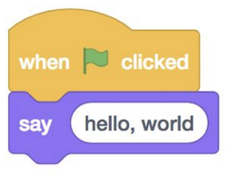
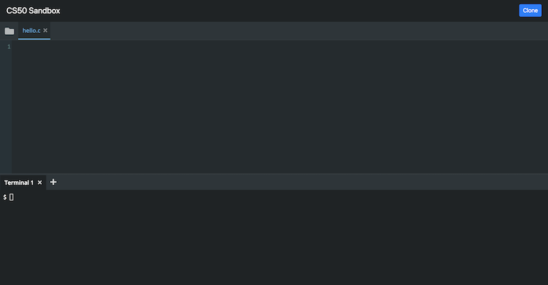
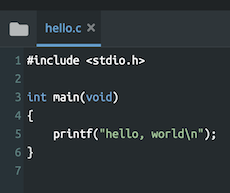
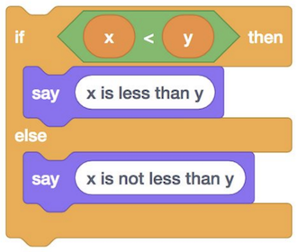
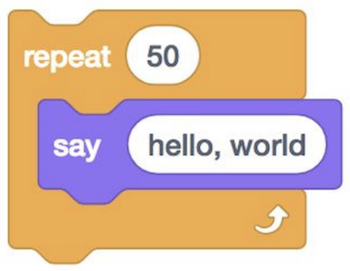

# Lecture: C

## C

*   Today we'll learn a new language, **C**: a programming language that has all the features of Scratch and more, but perhaps a little less friendly since it's purely in text:

        #include <stdio.h>

        int main(void)
        {
            printf("hello, world\n");
        }

    *   Though the words are new, the ideas are exactly as same as the "when green flag clicked" and "say (hello, world)" blocks in Scratch:

        

*   Though cryptic, don't forget that 2/3 of CS50 students have never taken CS before, so don't be daunted! And though at first, to borrow a phrase from MIT, trying to absorb all these new concepts may feel like drinking from a fire hose, be assured that by the end of the semester we'll be empowered by and experienced at learning and applying these concepts.

*   We can compare a lot of the constructs in C, to blocks we've already seen and used in Scratch. The syntax is far less important than the principles, which we've already been introduced to.

## hello, world

*   The "when green flag clicked" block in Scratch starts the main program; clicking the green flag causes the right set of blocks underneath to start. In C, the first line for the same is `int main(void)`, which we'll learn more about over the coming weeks, followed by an open curly brace `{`, and a closed curly brace `}`, wrapping everything that should be in our program.

        int main(void)
        {

        }

*   The "say (hello, world)" block is a function, and maps to `printf("hello, world");`. In C, the function to print something to the screen is `printf`, where `f` stands for "format", meaning we can format the printed string in different ways. Then, we use parentheses to pass in what we want to print. We have to use double quotes to surround our text so it's understood as text, and finally, we add a semicolon `;` to end this line of code.

*   To make our program work, we also need another line at the top, a header line `#include <stdio.h>` that defines the `printf` function that we want to use. Somewhere there is a file on our computer, `stdio.h`, that includes the code that allows us to access the `printf` function, and the `#include` line tells the computer to include that file with our program.

*   To write our first program in Scratch, we opened Scratch's website. Similarly, we'll use the [CS50 Sandbox](https://sandbox.cs50.io/) to start writing and running code the same way. The CS50 Sandbox is a virtual, cloud-based environment with the libraries and tools already installed for writing programs in various languages. At the top, there is a simple code editor, where we can type text. Below, we have a terminal window, into which we can type commands:

    

*   We'll type our code from earlier into the top, after using the `+` sign to create a new file called `hello.c`:

    

*   We end our program's file with `.c` by convention, to indicate that it's intended as a C program. Notice that our code is colorized, so that certain things are more visible.

## Compilers

*   Once we save the code that we wrote, which is called **source code**, we need to convert it to **machine code**, binary instructions that the computer understands directly.

*   We use a program called a **compiler** to compile our source code into machine code.

*   To do this, we use the **Terminal** panel, which has a **command prompt**. The `$` at the left is a prompt, after which we can type commands.

    *   We type `clang hello.c` (where `clang` stands for "C languages", a compiler written by a group of people). But before we press enter, we click the folder icon on the top left of CS50 Sandbox. We see our file, `hello.c`. So we press enter in the terminal window, and see that we have another file now, called `a.out` (short for "assembly output"). Inside that file is the code for our program, in binary. Now, we can type `./a.out` in the terminal prompt to run the program `a.out` in our current folder. We just wrote, compiled, and ran our first program!

## String

*   But after we run our program, we see `hello, world$`, with the new prompt on the same line as our output. It turns out that we need to specify precisely that we need a new line after our program, so we can update our code to include a special newline character, `\n`:

        #include <stdio.h>

        int main(void)
        {
            printf("hello, world\n");
        }

    *   Now we need to remember to recompile our program with `clang hello.c` before we can run this new version.

*   Line 2 of our program is intentionally blank since we want to start a new section of code, much like starting new paragraphs in essays. It's not strictly necessary for our program to run correctly, but it helps humans read longer programs more easily.

*   We can change the name of our program from `a.out` to something else, too. We can pass **command-line arguments**, or additional options, to programs in the terminal, depending on what the program is written to understand. For example, we can type `clang -o hello hello.c`, and `-o hello` is telling the program `clang` to save the compiled output as just `hello`. Then, we can just run `./hello`.

*   In our command prompt, we can run other commands, like `ls` (list), which shows the files in our current folder:

        $ ls
        a.out* hello* hello.c

    *   The asterisk, `*`, indicates that those files are executable, or that they can be run by our computer.

*   We can use the `rm` (remove) command to delete a file:

        $ rm a.out
        rm: remove regular file 'a.out'?

    *   We can type `y` or `yes` to confirm, and use `ls` again to see that it's indeed gone forever.

*   Now, let's try to get input from the user, as we did in Scratch when we wanted to say "hello, David":

    

        string name = get_string("What's your name?\n");
        printf("hello, %s\n", answer);

    *   First, we need a **string**, or piece of text (specifically, zero or more characters in a sequence in double quotes, like `""`, `"ba"`, or "bananas"), that we can ask the user for, with the function `get_string`. We pass the prompt, or what we want to ask the user, to the function with `"What is your name?\n"` inside the parentheses. On the left, we want to create a variable, `answer`, the value of which will be what the user enters. (The equals sign `=` is setting the value from right to left.) Finally, the type of variable that we want is `string`, so we specify that to the left of `answer`.

    *   Next, inside the `printf` function, we want the value of `answer` in what we print back out. We use a placeholder for our string variable, `%s`, inside the phrase we want to print, like `"hello, %s\n"`, and then we give `printf` another argument, or option, to tell it that we want the variable `answer` to be substituted.

*   If we made a mistake, like writing `printf("hello, world"\n);` with the `\n` outside of the double quotes for our string, we'll see an errors from our compiler:

        $ clang -o hello hello.c
        hello.c:5:26: error: expected ')'
            printf("hello, world"\n);
                                 ^
        hello.c:5:11: note: to match this '('
            printf("hello, world"\n);
                  ^
        1 error generated.

    *   The first line of the error tells us to look at `hello.c`, line 5, column 26, where the compiler expected a closing parentheses, instead of a backslash.

*   To simplify things (at least for the beginning), we'll include a library, or set of code, from CS50. The library provides us with the `string` variable type, the `get_string` function, and more. We just have to write a line at the top to `include` the file `cs50.h`:

        #include <cs50.h>
        #include <stdio.h>

        int main(void)
        {
            string name = get_string("What's your name?\n");
            printf("hello, name\n");
        }

*   So let's make a new file, `string.c`, with this code:

        #include <stdio.h>

        int main(void)
        {
            string name = get_string("What's your name?\n");
            printf("hello, %s\n", name);
        }

*   Now, if we try to compile that code, we get a lot of lines of errors. Sometimes, one mistake means that the compiler then starts interpreting correct code incorrectly, generating more errors than there actually are. So we start with our first error:

        $ clang -o string string.c
        string.c:5:5: error: use of undeclared identifier 'string'; did you mean 'stdin'?
          string name = get_string("What's your name?\n");
          ^~~~~~
          stdin
        /usr/include/stdio.h:135:25: note: 'stdin' declared here
        extern struct _IO_FILE *stdin;          /* Standard input stream.  */

    *   We didn't mean `stdin` ("standard in") instead of `string`, so that error message wasn't helpful. In fact, we need to import another file that defines the type `string` (actually a training wheel from CS50, as we'll find out in the coming weeks).

*   So we can include another file, `cs50.h`, which also includes the function `get_string`, among others.

        #include <cs50.h>
        #include <stdio.h>

        int main(void)
        {
            string name = get_string("What's your name?\n");
            printf("hello, %s\n", name);
        }

*   Now, when we try to compile our program, we have just one error:

        $ clang -o string string.c
        /tmp/string-aca94d.o: In function `main':
        string.c:(.text+0x19): undefined reference to `get_string'
        clang-7: error: linker command failed with exit code 1 (use -v to see invocation)

    *   It turns out that we also have to tell our compiler to add our special CS50 library file, with `clang -o string string.c -lcs50`, with `-l` for "link".

*   We can even abstract this away and just type `make string`. We see that, by default in the CS50 Sandbox, `make` uses `clang` to compile our code from `string.c` into `string`, with all the necessary arguments, or flags, passed in.

## Scratch blocks in C

*   The "set [counter] to (0)" block is creating a variable, and in C we would write `int counter = 0;`, where `int` specifies that the type of our variable is an integer:

    

*   "change [counter] by (1)" is `counter = counter + 1;` in C. (In C, the `=` isn't like an equals sign in a equation, where we are saying `counter` is the same as `counter + 1`. Instead, `=` is an assignment operator that means, "copy the value on the right, into the value on the left".) And notice we don't need to say `int` anymore, since we presume that we already specified previously that `counter` is an `int`, with some existing value. We can also say `counter += 1;` or `counter++;` both of which are "syntactic sugar", or shortcuts that have the same effect with fewer characters to type.

    

*   A condition would map to:

    

        if (x < y)
        {
            printf("x is less than y\n");
        }

    *   Notice that in C, we use `{` and `}` (as well as indentation) to indicate how lines of code should be nested.

*   We can also have if-else conditions:

    

        if (x < y)
        {
            printf("x is less than y\n");
        }
        else
        {
            printf("x is not less than y\n");
        }

    *   Notice that lines of code that themselves are not some action (`if...`, and the braces) don't end in a semicolon.

*   And even `else if`:

    

        if (x < y)
        {
            printf("x is less than y\n");
        }
        else if (x > y)
        {
            printf("x is greater than y\n");
        }
        else if (x == y)
        {
            printf("x is equal to y\n");
        }

    *   Notice that, to compare two values in C, we use `==`, two equals signs.

    *   And, logically, we don't need the `if (x == y)` in the final condition, since that's the only case remaining, and we can just say `else`.

*   Loops can be written like the following:

    

        while (true)
        {
            printf("hello, world\n");
        }

    *   The `while` keyword also requires a condition, so we use `true` as the Boolean expression to ensure that our loop will run forever. Our program will check whether the expression evaluates to `true` (which it always will in this case), and then run the lines inside the curly braces. Then it will repeat that until the expression isn't true anymore (which won't change in this case).

*   We could do something a certain number of times with `while`:

    

        int i = 0;
        while (i < 50)
        {
            printf("hello, world\n");
            i++;
        }

    *   We create a variable, `i`, and set it to 0. Then, while `i < 50`, we run some lines of code, and we add 1 to `i` after each run.

    *   The curly braces around the two lines inside the `while` loop indicate that those lines will repeat, and we can add additional lines to our program after if we wanted to.

*   To do the same repetition, more commonly we can use the `for` keyword:

        for (int i = 0; i < 50; i++)
        {
            printf("hello, world\n");
        }

    *   Again, first we create a variable named `i` and set it to 0. Then, we check that `i < 50` every time we reach the top of the loop, before we run any of the code inside. If that expression is true, then we run the code inside. Finally, after we run the code inside, we use `i++` to add one to `i`, and the loop repeats.

## Types, formats, operators

*   There are other types we can use for our variables
    *   `bool`, a Boolean expression of either `true` or `false`
    *   `char`, a single character like `a` or `2`
    *   `double`, a floating-point value with even more digits
    *   `float`, a floating-point value, or real number with a decimal value
    *   `int`, integers up to a certain size, or number of bits
    *   `long`, integers with more bits, so they can count higher
    *   `string`, a string of characters

*   And the CS50 library has corresponding functions to get input of various types:
    *   `get_char`
    *   `get_double`
    *   `get_float`
    *   `get_int`
    *   `get_long`
    *   `get_string`

*   For `printf`, too, there are different placeholders for each type:
    *   `%c` for chars
    *   `%f` for floats, doubles
    *   `%i` for ints
    *   `%li` for longs
    *   `%s` for strings

*   And there are some mathematical operators we can use:
    *   `+` for addition
    *   `-` for subtraction
    *   `*` for multiplication
    *   `/` for division
    *   `%` for remainder

# More examples

*   For each of these examples, you can click on the [sandbox links](/college/weeks/1/) to run and edit your own copies of them.

*   In `int.c`, we get and print an integer:

        #include <cs50.h>
        #include <stdio.h>

        int main(void)
        {
            int age = get_int("What's your age?\n");
            int days = age * 365;
            printf("You are at least %i days old.\n", days);
        }

    *   Notice that we use `%i` to print an integer.
    *   We can now run `make int` and run our program with `./int`.
    *   We can combine lines and remove the `days` variable with:

            int age = get_int("What's your age?\n");
            printf("You are at least %i days old.\n", age * 365);

    *   Or even combine everything in one line:

            printf("You are at least %i days old.\n", get_int("What's your age?\n") * 365);

    *   Though, once a line is too long or complicated, it may be better to keep two or even three lines for readability.

*   In `float.c`, we can get decimal numbers (called floating-point values in computers, because the decimal point can "float" between the digits, depending on the number):

        #include <cs50.h>
        #include <stdio.h>

        int main(void)
        {
            int price = get_float("What's the price?\n");
            printf("Your total is %f.\n", price * 1.0625);
        }

    *   Now, if we compile and run our program, we'll see a price printed out with tax.

    *   We can specify the number of digits printed after the decimal with a placeholder like `%.2f` for two digits after the decimal point.

*   With `parity.c`, we can check if a number is even or odd:

        #include <cs50.h>
        #include <stdio.h>

        int main(void)
        {
            int n = get_int("n: ");

            if (n % 2 == 0)
            {
                printf("even\n");
            }
            else
            {
                printf("odd\n");
            }
        }

    *   With the `%` (modulo) operator, we can get the remainder of `n` after it's divided by 2. If the remainder is 0, we know that `n` is even. Otherwise, we know n is odd.

    *   And functions like `get_int` from the CS50 library do error-checking, where only inputs from the user that matches the type we want is accepted.

*   In `conditions.c`, we turn the condition snippets from before into a program:

        // Conditions and relational operators

        #include <cs50.h>
        #include <stdio.h>

        int main(void)
        {
            // Prompt user for x
            int x = get_int("x: ");

            // Prompt user for y
            int y = get_int("y: ");

            // Compare x and y
            if (x < y)
            {
                printf("x is less than y\n");
            }
            else if (x > y)
            {
                printf("x is greater than y\n");
            }
            else
            {
                printf("x is equal to y\n");
            }
        }

    *   Lines that start with `//` are comments, or note for humans that the compiler will ignore.

    *   For David to compile and run this program in his sandbox, he first needed to run `cd src1` in the terminal. This changes the directory, or folder, to the one in which he saved all of the lecture's source files. Then, he could run `make conditions` and `./conditions`. With `pwd`, he can see that he's in a `src1` folder (inside other folders). And `cd` by itself, with no arguments, will take us back to our default folder in the sandbox.

*   In `agree.c`, we can ask the user to confirm or deny something:

        // Logical operators

        #include <cs50.h>
        #include <stdio.h>

        int main(void)
        {
            // Prompt user to agree
            char c = get_char("Do you agree?\n");

            // Check whether agreed
            if (c == 'Y' || c == 'y')
            {
                printf("Agreed.\n");
            }
            else if (c == 'N' || c == 'n')
            {
                printf("Not agreed.\n");
            }
        }

    *   We use two vertical bars, `||`, to indicate a logical "or", whether either expression can be true for the condition to be followed.

    *   And if none of the expressions are true, nothing will happen since our program doesn't have a loop.

*   Let's implement the coughing program from week 0:

        #include <stdio.h>

        int main(void)
        {
            printf("cough\n");
            printf("cough\n");
            printf("cough\n");
        }

*   We could use a `for` loop:

        #include <stdio.h>

        int main(void)
        {
            for (int i = 0; i < 3; i++)
            {
                printf("cough\n");
            }
        }

    *   By convention, programmers tend to start counting at 0, and so `i` will have the values of `0`, `1`, and `2` before stopping, for a total of three iterations. We could also write `for (int i = 1, i <= 3, i++)` for the same final effect.

*   We can move the `printf` line to its own function:

        #include <stdio.h>

        void cough(void);

        int main(void)
        {
            for (int i = 0; i < 3; i++)
            {
                cough();
            }
        }

        void cough(void)
        {
            printf("cough\n");
        }

    *   We declared a new function with `void cough(void);`, before our `main` function calls it. The C compiler reads our code from top to bottom, so we need to tell it that the `cough` function exists, before we use it. Then, after our `main` function, we can implement the `cough` function. This way, the compiler knows the function exists, and we can keep our `main` function close to the top.

    *   And our `cough` function doesn't take any inputs, so we have `cough(void)`.

*   We can abstract `cough` further:

        #include <stdio.h>

        void cough(int n);

        int main(void)
        {
            cough(3);
        }

        void cough(int n)
        {
            for (int i = 0; i < n; i++)
            {
                printf("cough\n");
            }
        }

    *   Now, when we want to print "cough" any number of times, we can just call the same function. Notice that, with `void cough(int n)`, we indicate that the `cough` function takes as input an `int`, which we refer to as `n`. And inside `cough`, we use `n` in our `for` loop to print "cough" the right number of times.

*   Let's look at `positive.c`:

        #include <cs50.h>
        #include <stdio.h>

        int get_positive_int(string prompt);

        int main(void)
        {
            int i = get_positive_int("Positive integer: ");
            printf("%i\n", i);
        }

        // Prompt user for positive integer
        int get_positive_int(string prompt)
        {
            int n;
            do
            {
                n = get_int("%s", prompt);
            }
            while (n < 1);
            return n;
        }

    *   The CS50 library doesn't have a `get_positive_int` function, but we can write one ourselves. Our function `int get_positive_int(string prompt)` will take in a `string` called `prompt` to show the user, and return an `int`, which our main function stores as `i`. In `get_positive_int`, we initialize a variable, `int n`, without assigning a value to it yet. Then, we have a new construct, `do ... while`, which does something _first_, then checks a condition, and repeats until the condition is no longer true.

    *   Once the loop ends because we have an `n` that is not `< 1`, we can return it with the `return` keyword. And back in our `main` function, we can set `int i` to that value.

## Screens

*   We might want a program that prints part of a screen from a video game like Super Mario Bros. In `mario0.c`, we have:

        // Prints a row of 4 question marks

        #include <stdio.h>

        int main(void)
        {
            printf("????\n");
        }

*   We can ask the user for a number of question marks, and then print them, with `mario2.c`:

        #include <cs50.h>
        #include <stdio.h>

        int main(void)
        {
            int n;
            do
            {
                n = get_int("Width: ");
            }
            while (n < 1);
            for (int i = 0; i < n; i++)
            {
                printf("?");
            }
            printf("\n");
        }

*   And we can print a two-dimensional set of blocks with `mario8.c`:

        // Prints an n-by-n grid of bricks with a loop

        #include <cs50.h>
        #include <stdio.h>

        int main(void)
        {
            int n;
            do
            {
                n = get_int("Size: ");
            }
            while (n < 1);
            for (int i = 0; i < n; i++)
            {
                for (int j = 0; j < n; j++)
                {
                    printf("#");
                }
                printf("\n");
            }
        }

    *   Notice we have two nested loops, where the outer loop uses `i` to do everything inside `n` times, and the inner loop uses `j`, a different variable, to do something `n` times for each of _those_ times. In other words, the outer loop prints `n` "rows", or lines, and the inner loop prints `n` "columns", or `#` characters, in each line.

*   Other examples not covered in lecture are available under "Source Code" for [Week 1](/college/weeks/1/).

# Memory, imprecision, and overflow

*   Our computer has memory, in hardware chips called RAM, random-access memory. Our programs use that RAM to store data as they run, but that memory is finite. So with a finite number of bits, we can't represent all possible numbers (of which there are an infinite number of). So our computer has a certain number of bits for each float and int, and has to round to the nearest decimal value at a certain point.

*   With `floats.c`, we can see what happens when we use floats:

        #include <cs50.h>
        #include <stdio.h>

        int main(void)
        {
            // Prompt user for x
            float x = get_float("x: ");

            // Prompt user for y
            float y = get_float("y: ");

            // Perform division
            printf("x / y = %.50f\n", x / y);
        }

    *   With `%50f`, we can specify the number of decimal places displayed.
    *   Hmm, now we get …

            x: 1
            y: 10
            x / y = 0.10000000149011611938476562500000000000000000000000

    *   It turns out that this is called **floating-point imprecision**, where we don't have enough bits to store all possible values, so the computer has to store the closest value it can to 1 divided by 10.
*   We can see a similar problem in `overflow.c`:

        #include <stdio.h>
        #include <unistd.h>

        int main(void)
        {
            for (int i = 1; ; i *= 2)
            {
                printf("%i\n", i);
                sleep(1);
            }
        }

    *   In our `for` loop, we set `i` to `1`, and double it with `*= 2`. (And we'll keep doing this forever, so there's no condition we check.)

    *   We also use the `sleep` function from `unistd.h` to let our program pause each time.

    *   Now, when we run this program, we see the number getting bigger and bigger, until:

            1073741824
            overflow.c:6:25: runtime error: signed integer overflow: 1073741824 * 2 cannot be represented in type 'int'
            -2147483648
            0
            0
            ...

    *   It turns out, our program recognized that a signed integer (an integer with a positive or negative sign) couldn't store that next value, and printed an error. Then, since it tried to double it anyways, `i` became a negative number, and then 0.

    *   This problem is called **integer overflow**, where an integer can only be so big before it runs out of bits and "rolls over". We can picture adding 1 to 999 in decimal. The last digit becomes 0, we carry the 1 so the next digit becomes 0, and we get 1000. But if we only had three digits, we would end up with 000 since there's no place to put the final 1!

*   The Y2K problem arose because many programs stored the calendar year with just two digits, like 98 for 1998, and 99 for 1999. But when the year 2000 approached, the programs would have stored 00, leading to confusion between the years 1900 and 2000.

*   A Boeing 787 airplane also had a bug where a counter in the generator overflows after a certain number of days of continuous operation, since the number of seconds it has been running could no longer be stored in that counter.

*   So, we've seen a few problems that can happen, but now understand why, and how to prevent them.

*   With this week's problem set, we'll use the CS50 Lab, built on top of the CS50 Sandbox, to write some programs with walkthroughs to guide us.
