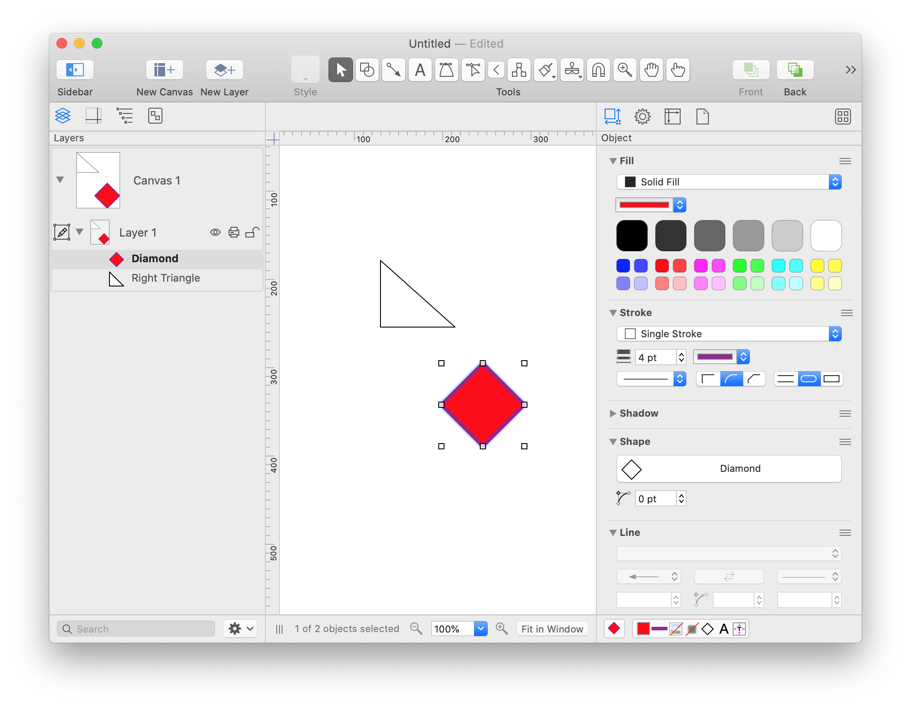

# Diagrammer

Het uiteindelijke doel van deze opdracht is het maken van een tool die figuren kan manipuleren. De figuren zijn in dit geval diagrammen waarin allerlei objecten op een canvas geplaatst worden en waarvan allerlei eigenschappen kunnen worden ingesteld. Omnigraffle is bijvoorbeeld een programma waarin zulke diagrammen kunnen worden gemaakt door directe manipulatie met hulp van toetsenbord en muis. Zie hieronder.

De tool die je hier gaat bouwen werkt niet met directe manipulatie maar kan via de command-line worden aangeroepen om transformaties op een figuur toe te passen. Zo zou je met hulp van die tool bijvoorbeeld een pipeline kunnen bouwen waarmee een hele map aan figuren stuk voor stuk aangepast worden, zoals bijvoorbeeld het verwijderen van het eerste object uit elke figuur. Zo zou de tool als volgt kunnen worden aangeroepen:

    diagrammer complex.fig simple.fig merge-layers
    diagrammer large.fig small.fig scale 0.5

Deze opdracht bestaat uit een aantal onderdelen waarin we toewerken naar de tool:

1. Bouwen van een verzameling klassen die het canvas, de objecten en eigenschappen modelleren

2. Schrijven van een methode om een figuur uit een string te kunnen inlezen en een figuur en alle objecten naar een string weg te schrijven

3. Bouwen van een verzameling klassen die elk een transformatie kunnen uitvoeren op een figuur en de objecten daarin

4. Schrijven van een hoofdprogramma waarmee een bestand wordt geopend, een transformatie toegepast, en het resultaat weer weggeschreven

Het uiteindelijke doel van de opdracht is het oefenen met objectgeoriënteerd ontwerp, kennis maken met *inheritance*, en verder oefenen met Python en werken met klassen.

## Voorbereiding

- Kijk voor een terugblik op Python nog eens het [videocollege](/lectures/python-david) van dit jaar.

- Kijk voor een terugblik op object-georiënteerd programmeren nog een keer het [korte college](/problems/objects/lecture).

- Lees vervolgens zorgvuldig over het gebruik van "inheritance" bij het ontwerpen van klassen: [Think Python hoofdstuk 18](http://greenteapress.com/thinkpython/html/thinkpython019.html).

## 1. Modelleren van diagrammen

Ontwerp een klassenstructuur waarmee de onderliggende data in het programma gemodelleerd worden. Hieronder vind je in meer algemene termen hoe de onderdelen genoemd worden. Aan jou de taak om hiervan een verzameling klassen te ontwerpen, met daarbij de belangrijkste attributen en de relaties tussen de verschillende klassen.

- Er zijn in  vormen, namelijk: cirkels, vierkanten, rechthoeken, ovalen, sterren met vijf punten en pijlen.

- De vormen zijn vast, maar er zijn per vorm enkele maten aan te geven. Een vierkant heeft bijvoorbeeld een "zijde" waarmee de hele vorm wordt vastgelegd. Een rechthoek heeft zowel een lengte als breedte.

- Elke vorm heeft bovendien een positie die variabel is en bepaalt waar in het diagram de vorm geplaatst is.

- Alle maten zijn in dezelfde eenheid gegeven, bijvoorbeeld pixels (maar de precieze aanduiding doet niet terzake).

- Het belangrijkste deel van een figuur is een zogeheten Canvas, waar alle objecten zich op bevinden.

- Elk Canvas heeft meerdere lagen (layers). Elk van de objecten in een diagram bevindt zich in feite op één van de lagen.

- Elk object kan zichtbaar of onzichtbaar worden gemaakt.

- Voor elk object kan een kleur van de rand en een kleur van de vulling worden ingesteld.

- Elke laag kan in z'n geheel zichtbaar of onzichtbaar worden gemaakt.

Maak een UML-diagram waarin je alle benodigde klassen definieert met de relaties en attributen. Bespreek je diagram in een groepje om te zorgen dat het compleet is en de relaties correct zijn aangegeven.

## 2. Inlezen en wegschrijven

Dit onderdeel volgt.
