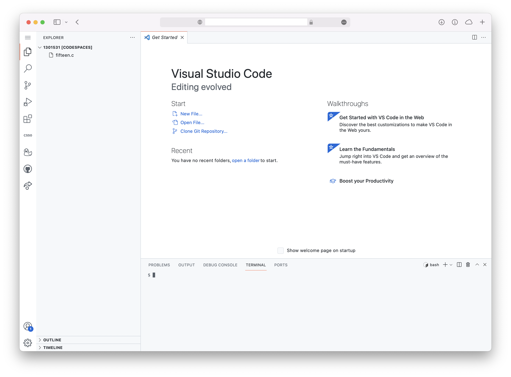
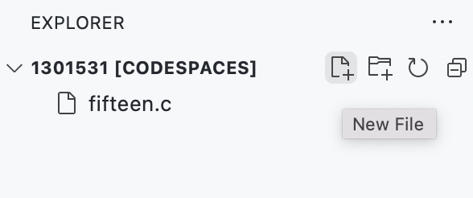

# Visual Studio Code

Aangezien de CS50 IDE problemen blijft geven, gaan we (voor één week) overschakelen op een online versie van Visual Studio Code.

> Zorg dat je deze week wel je oude uitwerkingen uit de CS50 IDE downloadt. Deze worden eind van het jaar verwijderd.

Gebruik deze link om in te loggen. **Zorg dat je niet de desktop-versie opent als je de keuze krijgt.** Na inloggen krijg je een melding "Setting up your workspace". Dit kan even duren.

Je scherm ziet er ongeveer zo uit als in de CS50 IDE. Je kunt ook op dezelfde manier programma's schrijven, `make`n en `check50` gebruiken.

Je kunt zo een nieuw bestand of map aanmaken:

